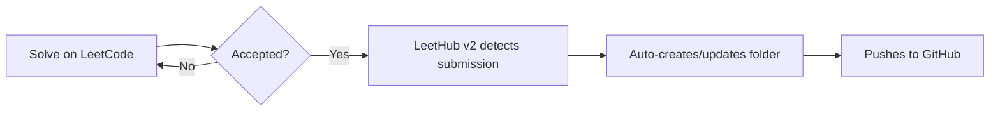

<div align="center">

# 🧠 LeetCode Solutions Vault

### Consistent grinding, one problem at a time — auto-synced with [LeetHub v2](https://github.com/arunbhardwaj/LeetHub-2.0)

[](https://leetcode.com/Mr-NILESH-KUMAR/)
[](https://github.com/Mr-NILESH-KUMAR/leetcode/commits/main)
[](https://github.com/Mr-NILESH-KUMAR/leetcode)
[](chrome-extension://mhanfgfagplhgemhjfeolkkdidbakocm/welcome.html)


</div>

<br/>

## 📌 About this Repo

This repository is my personal log of LeetCode problem-solving. Every accepted solution here was **pushed automatically** the moment it turned green on LeetCode — thanks to the **LeetHub v2** Chrome extension. Each folder holds the original problem notes plus my exact accepted submission, no manual copy-pasting involved.

> 💡 If it's in this repo, it passed every test case on LeetCode.

<br/>

## 📊 Progress Snapshot

<div align="center">

| 🟢 Easy | 🟡 Medium | 🔴 Hard | 📅 Total Solved | 🛠️ Primary Language |
|:---:|:---:|:---:|:---:|:---:|
|  |  |  |  |  |

</div>

<br/>

## 🗂️ Solutions by Topic

<details open>
<summary><b>⚡ Dynamic Programming / Kadane's Algorithm</b></summary>

| # | Problem | Difficulty | Solution | Notes |
|---|---------|:---:|:---:|-------|
| 53 | Maximum Subarray | 🟡 Medium | [Link](./0053-maximum-subarray) | Classic Kadane's algorithm, O(n) |

</details>

<details>
<summary><b>🔗 Arrays & Hashing</b></summary>

_More solutions coming soon — this section will grow as new problems get solved and auto-pushed by LeetHub._

</details>

<details>
<summary><b>🌲 Trees & Graphs</b></summary>

_Coming soon._

</details>

<details>
<summary><b>🪜 Two Pointers / Sliding Window</b></summary>

_Coming soon._

</details>

> ✏️ **Note:** As LeetHub auto-creates new folders, add a row here pointing to them — the folder name it generates (e.g. `0053-maximum-subarray`) becomes the link target directly.

<br/>

## 🛠️ Tech & Tools

<div align="center">


</div>

<br/>

## 📁 Repo Structure

```
📦 leetcode
 ┣ 📂 0053-maximum-subarray
 ┃ ┣ 📜 README.md         → problem statement (auto-added by LeetHub)
 ┃ ┗ 📜 maximum-subarray.cpp   → accepted solution
 ┗ 📜 README.md            → you are here
```

<br/>

## 🚀 How This Repo Stays Updated



<br/>

## 🌟 Why This Repo Exists

- 📈 Track consistency over time, not just problem count
- 🧩 Build a searchable personal DSA reference in C++
- 🔁 Revisit past solutions before interviews
- 🤝 Share approach & notes for anyone learning the same patterns

<br/>

## 📬 Connect

<div align="center">

[](https://leetcode.com/Mr-NILESH-KUMAR/)
[](https://github.com/Mr-NILESH-KUMAR)

⭐ **If this inspires your own DSA journey, consider starring the repo!** ⭐

</div>
