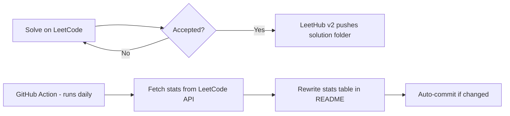

<div align="center">

# 🧠 LeetCode Solutions Vault

### Consistent grinding, one problem at a time — auto-synced with [LeetHub v2](https://github.com/arunbhardwaj/LeetHub-2.0)

[](https://leetcode.com/u/ni_lesh_/)
[](https://github.com/Mr-NILESH-KUMAR/leetcode/commits/main)
[](https://github.com/Mr-NILESH-KUMAR/leetcode)


</div>

<br/>

## 📌 About this Repo

This repository is my personal log of LeetCode problem-solving. Every accepted solution here is **pushed automatically** the moment it turns green on LeetCode, thanks to the **LeetHub v2** Chrome extension. Each folder holds the original problem notes plus my exact accepted submission.

> 💡 If it's in this repo, it passed every test case on LeetCode.

<br/>

## 📊 Live Stats

<!--START_SECTION:leetcode-stats-->
| 🟢 Easy | 🟡 Medium | 🔴 Hard | 📅 Total Solved | 🏆 Ranking |
|:---:|:---:|:---:|:---:|:---:|
| 49 | 26 | 0 | 75 / 3991 | 1973383 |

<sub>Last auto-updated: 2026-07-15 UTC · via GitHub Actions</sub>
<!--END_SECTION:leetcode-stats-->

This table **refreshes daily on its own** via a GitHub Action — no manual editing needed. See [how it works](#-how-this-repo-stays-updated) below.

<br/>

## 🗂️ Solutions by Topic

<details open>
<summary><b>⚡ Dynamic Programming / Greedy</b></summary>

| # | Problem | Difficulty | Solution |
|---|---------|:---:|:---:|
| 53 | Maximum Subarray | 🟡 Medium | [View Solution](https://github.com/Mr-NILESH-KUMAR/leetcode/tree/main/0053-maximum-subarray) |
| 121 | Best Time to Buy and Sell Stock | 🟢 Easy | [View Solution](https://github.com/Mr-NILESH-KUMAR/leetcode/tree/main/0121-best-time-to-buy-and-sell-stock) |
| 455 | Assign Cookies | 🟢 Easy | [View Solution](https://github.com/Mr-NILESH-KUMAR/leetcode/tree/main/0455-assign-cookies) |

</details>

<details open>
<summary><b>🔗 Arrays & Matrix</b></summary>

| # | Problem | Difficulty | Solution |
|---|---------|:---:|:---:|
| 73 | Set Matrix Zeroes | 🟡 Medium | [View Solution](https://github.com/Mr-NILESH-KUMAR/leetcode/tree/main/0073-set-matrix-zeroes) |

</details>

<details>
<summary><b>🌲 Trees & Binary Trees</b></summary>

_No problems synced yet in this category._

</details>

<details>
<summary><b>🪜 Two Pointers / Strings</b></summary>

_No problems synced yet in this category._

</details>

<details>
<summary><b>🔁 Backtracking / Divide & Conquer</b></summary>

_No problems synced yet in this category._

</details>

> ✏️ **Note:** 4 problems are synced to GitHub via LeetHub so far. As LeetHub pushes new folders, add a row here linking to each (the folder name LeetHub generates becomes the link path directly, e.g. `0001-two-sum`).

<br/>

## 🛠️ Tech & Tools

<div align="center">


</div>

<br/>

## 📁 Repo Structure

```
📦 leetcode
 ┣ 📂 .github/workflows
 ┃ ┗ 📜 update-readme.yml      → daily stats-refresh automation
 ┣ 📂 scripts
 ┃ ┗ 📜 update_stats.py        → fetches LeetCode stats, edits README
 ┣ 📂 0053-maximum-subarray
 ┃ ┣ 📜 README.md               → problem statement (auto-added by LeetHub)
 ┃ ┗ 📜 maximum-subarray.cpp    → accepted solution
 ┗ 📜 README.md                 → you are here
```

<br/>

## 🚀 How This Repo Stays Updated



Two independent automations work together:
1. **LeetHub v2** pushes a new folder every time you solve a problem.
2. **GitHub Actions** (`update-readme.yml`) runs once a day, calls the LeetCode stats API for `ni_lesh_`, and rewrites the *Live Stats* table above — no manual edits required.

<br/>

## ⚙️ Setup Notes (for this automation)

- The workflow file lives at `.github/workflows/update-readme.yml` and needs no secrets — it only reads a public stats endpoint.
- It runs daily at 00:00 UTC, on every push to `main`, and can also be triggered manually from the **Actions** tab (`Run workflow`).
- If you ever rename your LeetCode handle, update `LEETCODE_USERNAME` at the top of `scripts/update_stats.py`.

<br/>

## 🌟 Why This Repo Exists

- 📈 Track consistency over time, not just problem count
- 🧩 Build a searchable personal DSA reference in C++
- 🔁 Revisit past solutions before interviews
- 🤝 Share approach & notes for anyone learning the same patterns

<br/>

## 📬 Connect

<div align="center">

[](https://leetcode.com/u/ni_lesh_/)
[](https://github.com/Mr-NILESH-KUMAR)

⭐ **If this inspires your own DSA journey, consider starring the repo!** ⭐

</div>

<!---LeetCode Topics Start-->
# LeetCode Topics
## Array
|  |
| ------- |
| [0118-pascals-triangle](https://github.com/Mr-NILESH-KUMAR/leetcode/tree/master/0118-pascals-triangle) |
| [0860-lemonade-change](https://github.com/Mr-NILESH-KUMAR/leetcode/tree/master/0860-lemonade-change) |
| [1004-max-consecutive-ones-iii](https://github.com/Mr-NILESH-KUMAR/leetcode/tree/master/1004-max-consecutive-ones-iii) |
## Binary Search
|  |
| ------- |
| [1004-max-consecutive-ones-iii](https://github.com/Mr-NILESH-KUMAR/leetcode/tree/master/1004-max-consecutive-ones-iii) |
## Sliding Window
|  |
| ------- |
| [1004-max-consecutive-ones-iii](https://github.com/Mr-NILESH-KUMAR/leetcode/tree/master/1004-max-consecutive-ones-iii) |
## Prefix Sum
|  |
| ------- |
| [1004-max-consecutive-ones-iii](https://github.com/Mr-NILESH-KUMAR/leetcode/tree/master/1004-max-consecutive-ones-iii) |
## Greedy
|  |
| ------- |
| [0860-lemonade-change](https://github.com/Mr-NILESH-KUMAR/leetcode/tree/master/0860-lemonade-change) |
## Dynamic Programming
|  |
| ------- |
| [0118-pascals-triangle](https://github.com/Mr-NILESH-KUMAR/leetcode/tree/master/0118-pascals-triangle) |
## Hash Table
|  |
| ------- |
| [0389-find-the-difference](https://github.com/Mr-NILESH-KUMAR/leetcode/tree/master/0389-find-the-difference) |
## String
|  |
| ------- |
| [0389-find-the-difference](https://github.com/Mr-NILESH-KUMAR/leetcode/tree/master/0389-find-the-difference) |
## Bit Manipulation
|  |
| ------- |
| [0389-find-the-difference](https://github.com/Mr-NILESH-KUMAR/leetcode/tree/master/0389-find-the-difference) |
## Sorting
|  |
| ------- |
| [0389-find-the-difference](https://github.com/Mr-NILESH-KUMAR/leetcode/tree/master/0389-find-the-difference) |
<!---LeetCode Topics End-->